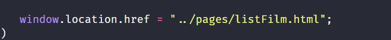

# Movie Project

## Link Deploy

[Vercel Movie Project](https://moviespace-project.vercel.app/)

## document object model (dom)

interface program yang memungkinkan developer melakukan pengubahan pada tampilan, konten hingga struktur website tersebut.

## Fungsi DOM

- Melakukan Aksi pada Elemen
- Menambahkan dan Menghapus Elemen
- Mengubah Atribut Elemen
- Memberikan Respon

## Cara kerja DOM

Cara kerjanya adalah memanipulasi sebuah halaman website supaya lebih dinamis dengan cara mengambil, menambahkan, mengubah atau menghapus elemen HTML.

## dom method

- document.getElementById(id)
- document.getElementsByClassName(name)
- document.querySelector(query)
- document.querySelectorAll(query)

## window VS document

### Objek Window :

Objek Window adalah objek global, objek utama yang memberi informasi tentang jendela browser.

### Document:

metode untuk memanipulasi DOM dan berinteraksi dengan konten halaman web.

### contoh window:

### contoh Document:

.png>)

## Event Propagation

Proses bagaimana browser menjalankan fungsi ketika terjadi interaksi (misal: klik) pada elemen bersarang.

1. Capturing Phase: Aliran event turun dari elemen terluar ke elemen target.
2. Target Phase: Event tepat berada pada elemen yang diklik.
3. Bubbling Phase: Aliran event naik kembali dari elemen target ke elemen terluar (Induk).
4. Kontrol: Gunakan event.stopPropagation() untuk menghentikan aliran event agar tidak memicu fungsi pada elemen induk.

## Fetch API: GET vs POST

### GET (Mengambil Data):

- Tujuan: Meminta data dari server.
- Data dikirim melalui parameter URL.
- Contoh: fetch('/api/users')

### POST (Mengirim Data):

- Tujuan: Mengirim/menyimpan data baru ke server.
- Data dikirim di dalam "Body".
- Memerlukan pengaturan method, headers, dan body.
